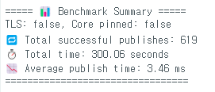

# experiment_rtos.md

## **1. Experimental Goals**

- Quantify the performance cost of TLS/mTLS in a FreeRTOS-based dual-core ESP32 system.
- Evaluate whether secure telemetry can maintain real-time constraints.
- Analyze how task placement (core pinning), mutual exclusion (mutex), and encryption interact.
- Identify bottlenecks across client, network, and server.

---

## **2. Hypotheses and Questions**

- H1: Core pinning improves performance via parallel task execution.
- H2: TLS introduces minimal delay but improves reliability.
- H3: TLS + pinning yields the best balance under constrained resources.
- H4: Retransmissions and bursty traffic correlate with mutex contention or Wi-Fi instability.

---

## **3. System Configuration**

### **3.1 Hardware**

- ESP32 DevKitC v1 (dual-core)
- BME680 Sensor (I2C)
- Wi-Fi via mobile hotspot (NAT)
- Mosquitto broker (Ubuntu 22.04)

### **3.2 Software**

- FreeRTOS with:
    - `SensorReadTask` (data acquisition)
    - `MqttPublishTask` (TLS or plain MQTT)
- TLS via `WiFiClientSecure` with PEM certs
- Synchronization via `xSemaphoreTake/Give`
- Benchmarks via `millis()`, total publish time, success count

---

## **4. Experimental Matrix**

| Case | TLS | Core Pinned | Interval | Description |
| --- | --- | --- | --- | --- |
| C1 | ❌ | ❌ | 1000ms | Plain MQTT baseline |
| C2 | ❌ | ✅ | 1000ms | Plain MQTT + pinned |
| C3 | ✅ | ❌ | 1000ms | TLS, unpinned |
| C4 | ✅ | ✅ | 1000ms | TLS + core pinned |
| B1 | ✅ | ✅ (Swapped) | 1000ms | TLS + pinned (swapped cores) |
| B2 | ❌ | ✅ (Swapped) | 1000ms | Plain + pinned (swapped cores) |

---

## **5. Raw Results**

.png)

## Case1) TLS: False, Core pinned: False

## Case2) TLS: False, Core pinned: True

## Case3) TLS: True Core pinned: False

## Case4) TLS: True, Core pinned: True

## Bonus1: TLS: True, Core pinned: True, Core Swapped

## Bonus2: TLS: False, Core pinned: True, Core Swapped

| Case | Avg Time | Success | Notes |
| --- | --- | --- | --- |
| C1 | 3.46 ms | 619 | Plain, unpinned |
| C2 | 17.96 ms | 622 | Pinning degraded performance |
| C3 | 2.00 ms | 642 | TLS outperformed expectations |
| C4 | 3.44 ms | 642 | TLS + pinning stable |
| B1 | 2.00 ms | 581 | TLS + pinned + core swap improved |
| B2 | 1.84 ms | 580 | Fastest: plain + pinned + core swap |

---

## **6. Visualization**

- Grafana Dashboard (5s refresh)
- C1: visible delays
- C3/C4/B1: stable TLS telemetry
- C2: delays due to poor core assignment
- TCP flow captured via Wireshark and InfluxDB

---

## **7. Packet-Level Analysis**

Normal

Abnormal

- Spurious Retransmissions (e.g., pkt 25910, 27388)
- Bursty MQTT frames (e.g., pkt 27477)

- Repeated Duplicate ACKs (e.g., 25912)

---

## **8. Root Cause Analysis**

### **8.1 Client-Side**

- Blocking on `xSemaphoreTake(...)` when tasks not scheduled optimally
- Fast intervals + mutex = delay amplification
- ESP32 Wi-Fi stack interference on Core 0

### **8.2 Network-Side**

- Mobile hotspot caused burst latency + retransmits
- Spurious retransmissions due to delayed ACKs

### **8.3 Server-Side**

- Mosquitto processed TLS reliably
- TCP window size was sufficient
- Telegraf consumed bursty traffic consistently

---

## **9. Comparative Insights**

| Configuration | Avg Time | Notes |
| --- | --- | --- |
| B2: Plain, pinned swap | 1.84 ms | Fastest overall |
| C3: TLS, unpinned | 2.00 ms | Very stable |
| B1: TLS, pinned swap | 2.00 ms | Fast and secure |
| C4: TLS, pinned | 3.44 ms | Acceptable |
| C1: Plain, unpinned | 3.46 ms | Baseline |
| C2: Plain, pinned | 17.96 ms | Inefficient core assignment |

---

## **10. Design Implications**

- Core affinity matters: TLS works best when MQTT runs on Wi-Fi’s core.
- TLS overhead is negligible with ESP32 crypto acceleration.
- Pinning can harm performance if Wi-Fi and app compete on same core.
- Best designs pin sensor to Core1, MQTT to Core0 (Wi-Fi stack alignment)

---

## **11. Configuration Optimization**

| Setting | Recommended | Justification |
| --- | --- | --- |
| INTERVAL_MS | ≥500 ms | Avoid mutex + task drift |
| Core Assignment | Sensor → Core1MQTT → Core0 | Wi-Fi alignment |
| TLS | Enable (v1.2) | Secure with minimal cost |
| Synchronization | mutex + notify | Light and safe |

---

## **12. Future Experiments**

- QoS 0 vs 1 delivery under loss
- ECC certificates for smaller footprint
- Replay attack resistance on mTLS
- Wi-Fi signal loss + reconnect behavior

---

## **📌 Key Discoveries**

1. **Core swapping reversed poor performance**
    
    Original: Sensor=Core0, MQTT=Core1 → Bad
    
    Swapped: Sensor=Core1, MQTT=Core0 → Fastest
    
2. **TLS is safe**
    
    TLS added negligible latency across all benchmarks.
    
3. **Pinning only helps if mapped correctly**
    
    Pinning can degrade if MQTT is blocked by Wi-Fi stack contention.
    

---

Thank you!
