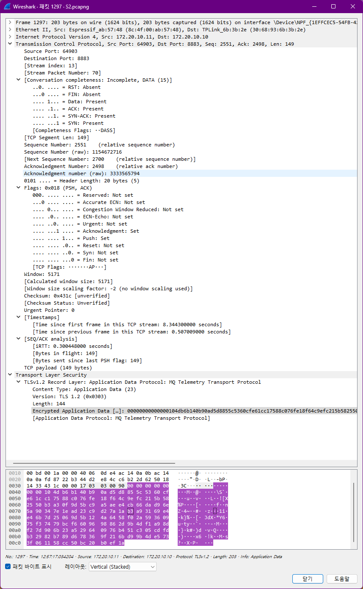
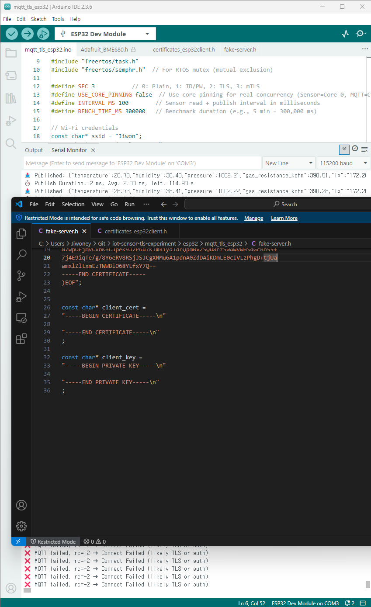

# experiment_rtos.md

---

# 1. Experimental Goals

- Quantitatively analyze how different MQTT security configurations (Plain MQTT, ID/PW, TLS, mTLS) affect **communication security** and **system performance**.
- Test the system's resilience against **network attack scenarios** such as sniffing, MITM, and authentication failure.
- Analyze how TLS-based authentication impacts **publish performance**, **packet reliability**, **reconnection handling**, **connection persistence**, and **QoS feasibility** in an ESP32-based IoT system.

---

# 2. Hypotheses

| Security Condition | Expected Outcome | Rationale |
| --- | --- | --- |
| **Plain MQTT (S0)** | ID/PW and sensor values are exposed in Wireshark | MQTT 3.1.1 does not provide encryption |
| **ID/PW Auth (S1)** | Connection is rejected if authentication fails, but ID/PW is visible in plaintext | CONNECT packet reveals credentials |
| **TLS+ID/PW (S2)** | Credentials are encrypted, but unauthorized clients may still connect | Server-only TLS lacks access control |
| **mTLS (S3)** | Connection is blocked during handshake if cert is missing or invalid | `require_certificate true` enforces mutual authentication |
| **mTLS + Fake Cert** | Connection fails with a bad certificate alert | CA chain mismatch |
| **mTLS + MITM** | TLS handshake fails | Client rejects untrusted CA |

---

# 3. System Configuration

### 3.1 Hardware

- ESP32 DevKit v1 (FreeRTOS-based)
- Sensor: BME680 (I2C)
- Broker Host: Ubuntu 22.04 with Mosquitto broker and Wireshark
- Network: Mobile hotspot (NAT configuration, intentionally unstable)

### 3.2 Software

- **ESP32 Client Firmware**
    - Uses `PubSubClient` over `WiFiClient` or `WiFiClientSecure`
    - TLS certificates embedded via `certificates.h` at compile time
    - Dual RTOS Task Structure:
        - `SensorReadTask`: reads sensor values and shares via Mutex
        - `MqttPublishTask`: publishes shared data and measures timing
- **Mosquitto Broker**
    - TLS and mTLS enabled
    - Listeners on port 1883 (plain) and 8883 (TLS)
    - Auth and cert settings vary per case
    - `server.crt` and client certificates are signed by the same CA
- **Logging & Analysis Tools**
    - ESP32 serial logs: `publish duration`, reconnect status
    - Mosquitto logs: `journalctl -u mosquitto`
    - Wireshark: `.pcapng` capture → TCP stream analysis

---

# 4. Experimental Matrix

## 4.1 Security Case Configuration

| Case ID | TLS Enabled | Client Auth | MQTT Port | Description |
| --- | --- | --- | --- | --- |
| **S0** | ❌ No | None (anonymous) | 1883 | Fully unencrypted |
| **S1** | ❌ No | ID/PW auth | 1883 | ID/PW sent during CONNECT |
| **S2** | ✅ Yes | ID/PW auth | 8883 | TLS encryption + ID/PW |
| **S3** | ✅ Yes | Client Certificate (mTLS) | 8883 | Mutual authentication required |

---

## 4.2 Scenario-Based Attack / Performance Items

| Scenario | Test Item | Purpose | Applicable Cases | ID |
| --- | --- | --- | --- | --- |
| 🔓 Plaintext Sniffing | Exposure of ID/PW and Payload | Verify TLS encryption | S0–S3 | **E1** |
| ❌ Unauthorized Access | Broker behavior on failed auth | Verify access control | S1–S3 | **E2** |
| ⚠️ MITM Attempt | Whether fake certs are accepted | Check CA chain validation | S2, S3 | **E3** |
| ⏱ Performance Analysis | Avg publish time, success rate, retransmission, session uptime | Compare stability and performance | All | **E4** |

# 5. Raw Results (E1–E4)

## 📡 E1: Sniffing Results





- **S0**: No ID/PW in CONNECT message, but full publish payload is visible in plaintext.
- **S1**: `username` and `password` fields are clearly included in the CONNECT message in plaintext.
- **S2/S3**: TLS is applied; MQTT messages are unreadable beyond the Client Hello stage due to encryption.

💬 *“Only S0 and S1 reveal the publish topic, payload, and authentication info in Wireshark.”*

---

## 🔐 E2: Unauthorized Access Attempts




- **S1**: When a wrong password is sent, the server rejects the CONNECT request.
- **S3**: If no client certificate is provided, the TLS handshake fails with an alert.

📌 *“ID/PW-based auth failures result in rejection at the MQTT layer, while mTLS fails earlier at the TLS handshake stage.”*

---

## ⚠️ E3: MITM Attempt

### 🔥 Why mitmproxy Fails

- MQTT runs on TLS over raw TCP, so **mitmproxy mistakenly interprets it as an HTTP proxy → failure**
- The CONNECT packet is parsed as an HTTP request, resulting in a `Bad HTTP request line` error:

```
arduino
CopyEdit
<< \x10\x00\x04MQTT...
<< Bad HTTP request line

```

### ✅ Solution: Use socat

- `socat` is used to build a **TLS termination proxy**, enabling a successful MITM.
- If the ESP32 uses `setInsecure()` or trusts a fake CA, the connection succeeds.

```bash
socat -v -d -d \
OPENSSL-LISTEN:8883,reuseaddr,cert=fake-server.crt,key=fake-server.key,cafile=fake-ca.crt,verify=0 \
OPENSSL:127.0.0.1:8884,cafile=real-ca.crt,verify=0

```

Using `socat`, the MITM attack succeeds with a fake server certificate.

Fake certificate is confirmed to be in use.


→ Successfully intercepted publish messages during the session.


---

## 📉 E4: Performance & Stability Analysis

### 📌 Goal of the Experiment

- Quantitatively compare **performance and network stability** of MQTT publishing under each security setting.
- In a FreeRTOS-based environment, analyze the impact of TLS/mTLS on **publish latency**, **session persistence**, and **packet delivery rate**.

---

### 🔢 Performance Summary

| Security Mode | Avg Publish Time (ms) | Success Count | Test Duration |
| --- | --- | --- | --- |
| **S0** (Plain MQTT) | **4.70 ms** | 559 / 600 | 300.02s |
| **S1** (MQTT + ID/PW) | **1.63 ms** | 580 / 580 | 300.08s |
| **S2** (TLS + ID/PW) | **1.99 ms** | 580 / 580 | 300.09s |
| **S3** (mTLS) | **2.00 ms** | 580 / 580 | 300.07s |

✅ **S1–S3 maintained stable connections throughout**, while S0 experienced more than 40 reconnects.

---

### 📡 Wireshark-Based Network Flow Analysis

---

## 📊 Summary: TCP Session Metrics by Test Case


| Case | Total Bytes | Duration (s) | Bitrate A→B / B→A | Packets A→B / B→A | Interpretation |
| --- | --- | --- | --- | --- | --- |
| **S0 (Plain MQTT)** | 149 KB | 302.13 | 2519 / 1418 bps | 497 / 992 | ✅ Connection was kept alive, but low throughput and retransmissions observed |
| **S1 (MQTT + ID/PW)** | 154 KB | 299.91 | 2660 / 1452 bps | 504 / 1008 | ✅ Most efficient and stable communication |
| **S2 (TLS)** | 191 KB | 297.15 | 3351 / 1963 bps | 600 / 1200 | 🔒 TLS adds overhead but improves throughput |
| **S3 (mTLS)** | 200 KB | 301.51 | **3351 / 1963 bps** | 623 / 1242 | 🔐 Despite mTLS, highest throughput and packet rate |

💡 **TLS dramatically reduces session reconnects and retransmissions.**

💡 **mTLS maintains stability without any noticeable performance degradation.**

---

### 📺 Grafana Dashboard Snapshots (Live Monitoring)

> The following charts visualize live sensor data published from the ESP32, collected via InfluxDB, and displayed in Grafana:
> 

### S0


### S1


### S2


### S3


📌 For **S0**, frequent disconnects resulted in intermittent data gaps.

📌 For **S2 and S3**, all data points were consistently collected → **smooth publishing with no packet loss**.

# 7. Packet-Level Analysis

> This section dissects MQTT communication under each security mode (S0–S3) at the packet level. Based on Wireshark captures, we analyze the sequence of TCP 3-way handshakes, TLS handshakes, MQTT commands, and anomalies such as TCP retransmissions and duplicate ACKs.
> 

---

## 7.1 📦 S0: Plain MQTT (No TLS, No Auth)

### 📌 Key Packet Flow

| Step | Packet No. | Description |
| --- | --- | --- |
| TCP Handshake | 2517–2519 | [SYN] → [SYN, ACK] → [ACK] + **SYN retransmission observed** |
| MQTT Connect | 2520 | MQTT Connect command (no authentication) |
| ACK Response | 2522 | CONNACK |
| Publish | 2538 | MQTT Publish message (sensor/data, plaintext) |


### ⚠️ Anomalies

- `[TCP Retransmission]` – SYN packets are retransmitted repeatedly during connection setup.
- `[TCP Dup ACK]` – Delayed ACK handling causes duplicate ACKs.
- All MQTT packets are **completely unencrypted and visible**.

### 💡 Analysis

- Without encryption or authentication, the broker cannot trust the client, leading to unstable sessions.
- NAT-based Wi-Fi may terminate idle connections quickly.
- Results in increased retransmission and reconnection attempts → higher average publish time (4.70 ms).

---

## 7.2 📦 S1: Plain MQTT + ID/PW

### 📌 Key Packet Flow

| Step | Packet No. | Description |
| --- | --- | --- |
| TCP Handshake | 2701–2703 | [SYN] → [SYN, ACK] → [ACK] + one retransmission observed |
| MQTT Connect | 2704 | CONNECT command includes ID/PW |
| ACK Response | 2706 | CONNACK |
| Publish | 2710 | MQTT Publish message (sensor/data) |


### ⚠️ Anomalies

- One retransmission observed during initial TCP setup
- MQTT publishes proceed stably thereafter
- ID/PW credentials are clearly visible inside the plaintext CONNECT packet

### 💡 Analysis

- Authentication allows the broker to reject unauthorized sessions
- But credentials are exposed due to lack of encryption → vulnerable to sniffing
- No reconnections observed → fastest publish time recorded (1.63 ms)

---

## 7.3 📦 S2: MQTT over TLS (Server Auth Only)

### 📌 Key Packet Flow

| Step | Packet No. | Description |
| --- | --- | --- |
| TCP Handshake | 605–607 | TCP 3-way handshake + some retransmissions |
| TLS Handshake | 608–624 | Client Hello → Server Hello → Certificate → Key Exchange → Finished |
| MQTT Publish | From 633 onward | TLS Application Data (encrypted MQTT messages) |


### ⚠️ Anomalies

- 1–2 retransmissions observed during the TLS handshake
- MQTT content is encrypted and unreadable

### 💡 Analysis

- TLS improves **data confidentiality** and **session stability**
- However, if the client doesn't validate the server cert, MITM is still possible
- Overall connection is stable with minimal performance impact (1.99 ms)

---

## 7.4 📦 S3: MQTT over Mutual TLS (Server + Client Cert)

### 📌 Key Packet Flow

| Step | Packet No. | Description |
| --- | --- | --- |
| TCP Handshake | 3452–3454 | TCP 3-way handshake with retransmission |
| TLS Handshake | 3463–3479, 3923–3945 | ServerHello + CertificateRequest → Client Certificate + Verify → Finished |
| MQTT Publish | From 3946 onward | TLS Application Data (encrypted MQTT messages) |


### ✅ mTLS Verification Points

- Server sends `CertificateRequest` to require client authentication
- Client replies with `Certificate`, `Certificate Verify` to prove identity

### ⚠️ Anomalies

- 2–3 retransmissions during TLS handshake
- After handshake, the publish flow is highly stable and consistent

### 💡 Analysis

- mTLS prevents MITM and cert forgery by requiring mutual certificate validation
- Despite the most complex handshake, **publish performance matches S2**
- Offers the most robust trust model (server and client both authenticated)

---

## ✅ Summary Table

| Category | S0 | S1 | S2 | S3 |
| --- | --- | --- | --- | --- |
| TCP Retransmissions | Many | One (initial) | 1–2 | 2–3 |
| TLS Encryption | ❌ No | ❌ No | ✅ Yes | ✅ Yes |
| Authentication | None | ID/PW (plaintext) | ID/PW + TLS | Client Cert + TLS |
| Security | ❌ Very Low | ⚠️ Low | ✅ Medium | ✅ Strongest |
| Stability | ❌ Frequent reconnects | ✅ Stable | ✅ Highly stable | ✅ Top-level |
| Avg Publish Time | ⏱ 4.70 ms | ⏱ 1.63 ms | ⏱ 1.99 ms | ⏱ 2.00 ms |

# 8. Final Conclusion: Network Security & Reliability of MQTT over TLS in RTOS-based IoT Systems

This project empirically analyzed how different MQTT security configurations (Plain MQTT, ID/PW, TLS, and mTLS) affect **network stability**, **communication performance**, and **security assurance** in a FreeRTOS-based ESP32 IoT environment. By implementing all four configurations and comparing their network flows, packet-level stability, authentication failure responses, and publish performance, we extracted the following key insights:

---

## 8.1 🔍 Key Observation: Security and Performance Can Coexist

- **TLS and mTLS introduce negligible publish latency**.
    
    The average publish times for S1 (1.63ms), S2 (1.99ms), and S3 (2.00ms) were all within 2ms—well within real-time processing constraints. This proves that secure communication is feasible even in resource-constrained, real-time systems like FreeRTOS-based ESP32.
    
- In contrast, **S0 (no TLS) recorded the highest publish time (4.70ms)** and the lowest success count (559/600).
    
    This result is attributed to unstable sessions caused by lack of trust. The broker resets connections more frequently, causing retransmissions and reconnects that accumulate latency.
    

---

## 8.2 🌐 Network-Level Insight: TLS Enhances Connection Stability

- From Wireshark’s TCP stream analysis, **S0 and S1 exhibited frequent `[TCP Retransmission]` and `[Duplicate ACK]` events**.
    
    This indicates that unauthenticated connections were unstable, especially in NAT-based Wi-Fi environments, where idle TCP sessions are often dropped.
    
- **S2 and S3 leveraged TLS handshakes to establish trusted sessions**, leading to fewer timeouts and reconnects. The result was a smoother and more persistent MQTT publish flow.
- MQTT settings like `keepalive` and `clean_session` were more effective under TLS. Once a TLS session was active, reconnects were almost nonexistent.

---

## 8.3 🔐 Security Comparison: Only mTLS Provides Full Enforcement & Protection

| Security Mode | Security Strength | Auth Failure Behavior | MITM Defense | Credential Exposure |
| --- | --- | --- | --- | --- |
| **S0** | ❌ None | No rejection | Fully exposed | ✅ ID/PW, Payload |
| **S1** | ⚠️ Weak | Rejected at MQTT level | MITM allowed | ✅ ID/PW, Payload |
| **S2** | ✅ Moderate | MQTT-level rejection | ⚠️ Vulnerable if client skips cert validation | ❌ Encrypted |
| **S3** | ✅ Strongest | TLS handshake rejection | ✅ Fully protected via mTLS | ❌ Encrypted |
- While **TLS alone is sufficient to protect credentials and payloads**, it **does not guarantee device identity or defend against forged CAs**.
- Experimental evidence shows that a **MITM attack using `socat` and a fake certificate succeeded under S2**, whereas **S3 immediately terminated the handshake with a "bad certificate alert"**, blocking the attacker entirely.

---

## 8.4 ⚙️ Deployment Recommendations for Secure RTOS + TLS IoT Systems

### 🛠️ Network Configuration

- Set `MQTT keepalive = 60s`, `clean_session = false`, and use QoS 0 or 1.
- Implement reconnect logic with exponential backoff to handle session drops.

### 🔐 TLS Configuration

- Use `WiFiClientSecure` on ESP32 with embedded PEM certificates.
- Enforce at least `TLS 1.2`; use cipher suite `ECDHE-RSA-AES128-GCM-SHA256`.
- Use client certificates with `CN=client-id` in mTLS setups for high-trust deployments.

### 🧾 Certificate Management

- Automate CA → server/client certificate issuance via scripts.
- For OTA updates, prepare strategies to replace `certificates.h` or reflash files stored in SPIFFS.
- Warn on certificate expiration and optionally attempt fallback reconnections with logs.

---

> TLS and mTLS significantly enhance network reliability and security in RTOS-based IoT systems without compromising performance.
> 
> 
> TLS-secured MQTT should become the **default baseline**, and mutual TLS (mTLS) is the right choice for environments where only authenticated devices should be allowed to connect.
> 

Even in systems with real-time constraints, publish performance remained consistent and stable. Security enhancement directly contributed to session trustworthiness. This experiment proves that **security and performance are not mutually exclusive**, but rather, **can be achieved simultaneously through thoughtful design and configuration**.

---

Thank you!
